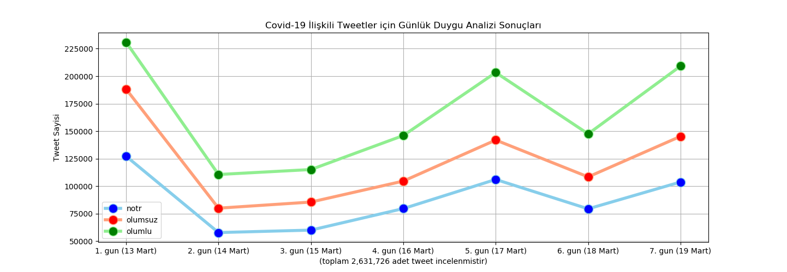
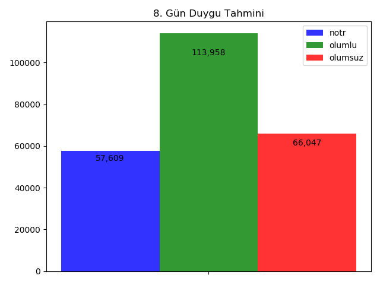
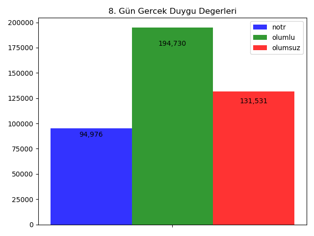

Farklı çalışmalar için arikansm github kullanıcısına ait diğer depolara [buradan](https://github.com/arikansm?tab=repositories) ulaşabilirsiniz.

# Koronavirüs Tweetleri Gün Bazlı Duygu Tahmini

Koronavirüs ile ilişkili olarak paylaşılacak ingilizce tweetler arasındaki duygu dağılımı tahmin edecek bir uygulama üzerine çalışma gerçekleştirilmiştir. Geliştirilen kaynak kodları yaklaşık olarak 190 satırdan oluşmaktadır. 

Çalışma kapsamında 1 haftalık (13-19 Mart 2020) gerçek tweetler toplanmıştır. Yaklaşık 2,5 milyon tweet üzerinde gün bazlı duygu analizi gerçekleştirilerek 8. gün (20 Mart 2020) için paylaşılacak tweetler arasındaki duygu dağılımı tahmin edilmiştir. Duygu tahminleri için doğal dil işleme kütüphanlerinden nltk tercih edilirken, gelecek tahmini için zaman serisi analizi algoritmaları arasından prophet kullanılmıştır.  

Öncelikle 1 hatalık tweetler ilgili dosyalardan okunur. Elde edilmiş veriler arasından yalnızca ingilizce olanlar seçilir. Tweetlerden duygu analizi için önemsiz olan kayıtların çıkarılması amacıyla önişlem adımları uygulanır. Bu adımlar; url adreslerinin temizlenmesi, tüm karakterlerin küçük harfe çevrilmesi, noktalama işaretlerinin silinmesi ve gereksiz kelimelerin (ve-and, veya-or, vb.) çıkarılması faaliyetlerinden oluşmaktadır. Önişlem adımlarının tamamlanması ile nltk kütüphanesi üzerinden duygu analizi için puanlama yapılır. Her tweet için hesaplanan bu puanlama 0 ise nötr, 0 dan büyün ise olumlu, 0 dan küçük ise olumsuz olarak duygu yönelimi kabul edilir. Böylece her tweet için duygu analizi yapılmış olur. Yapılan analiz için aşağıda görüldüğü üzere grafik çizdirilmiştir.



Bu bilgiler ışığında 8. Gün için paylaşılacak tweetlerin duygu dağılımı tahmin edilmeye çalışılmıştır. Bu kapsamda zaman serisi algoritması kullanılması uygun görülmüş ve prophet tercih edilmiştir. 



Prophet ile duygu dağılımı tahmin edilen 8. gün için karşılaştırma yapmak adına ilgili günün tweet verisi analiz edilerek gerçek duygu dağılımı da hesaplanmıştır. Her iki sonuç aşağıda görülebildiği üzere kullanıcı için çizdirilmiştir. Sonuç olarak duygular arası orantı benzer olarak tahmin edilirken toplam tweet sayısı 8. günün gerçek tweet sayısına nazaran daha az hesaplanmıştır.



## Video

Program çalışması sırasında ekran kaydı alınmış ve video üzerine çeşitli açıklamalar eklenerek [şu adreste](./medya/video.mp4) sunulmuştur.

```
Süleyman Muhammed ARIKAN
```
